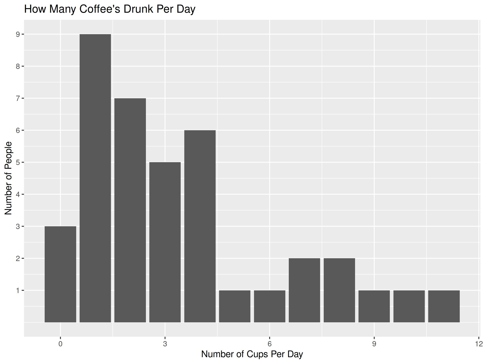

# Coffee: A Researchers Best Friend

A collection of files and processes related to Daniel Bretts study of the percieved effects of coffee when consumed at different times of day.

**This is a fake study and all data, comments, and code are fabricated for example purposes**

## Hypothesis

Coffee is good.  But does it help you get more work done? 

## Initial Study

The initial study included a survey (Coffee-Survey.txt) to researchers at Brock University to determine how many drink coffee, how many per day, and at what times of day they were consumed.  The data collected from this survey (Coffee-Survey-Results.csv) was processed by an R programming script (Survey-Results-Cleanup.R) which produces bar charts of the results for quick reference (see below for an example).

## The Paper

A paper was written on the results comparing findings with expectations.  The paper was the published in The Journal Of Cool Things and a copy of the accepted version of the article is available in this repository.

[Link to Published Version](https://danielbrett.github.io/Totally-Real-Journal-Of-Cool-Things/)

## Replication

If anyone wants to recreate this work, they can fork this repository and run the workflow called **Survey Data Analysis** which will process the data in the file called **Coffee-Survey-Results.csv** and generate bar charts into the repository by running the R script called **Survey-Results-Cleanup**.  

## Re-Use

The data structure and script in this repository are open for re-use so long as attribution is given in any published outcomes.  The easiest way to re-use this work is to fork the repository and exchange the data in the **Coffee-Survey-Results.csv** file with your own and then running the workflow called **Survey Data Analysis**.

